# Flutter Arch CLI

## Code generator to facilitate clean architecture

###### [Documentation in pt-BR](https://github.com/jheimes-silveira/flutter_clean_cli/blob/master/README_pt_BR.md)

Get Start:
```bash
dart pub global activate flutter_clean_cli
```

Or:

```bash
dart pub global activate --source path ./RepositoryProject
```

### Overview

To make it easier and more intuitive to implement _Uncle Bob's Clean Architecture_. This CLI provides the base structure, where will dynamically generate the Classes as shown in the examples below.

You can also have the advantage of editing in an easy and dynamic way through the editing of template and __triggers__ to apply __replace__ in some piece of code and create new files from the commands.

### Commands:

```bash
flutter_clean_cli init 
```

Create the configurable variables of your project, generating a basic structure, where will generate a `.flutter_clean_cli` folder.

---

```bash
# Generate Micro Frontend
flutter_clean_cli mf
```
Select the component you want to create and write the name in snakeCase.

<details>
<summary>Result</summary>

```bash
? Which component do you want to create? › 
❯ micro_app
  micro_commons
  micro_core
  base_app
```

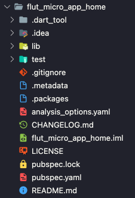
</details>

---

```bash
# Generate Layer
flutter_clean_cli g layer lib/app/module/home
# Or
flutter_clean_cli g l lib/app/module/home
```
<details>
<summary>Result</summary>

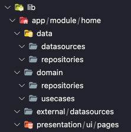
</details>

--- 

```bash
# Generate Page
flutter_clean_cli g page lib/app/module/home HomeCards
# Or
flutter_clean_cli g p lib/app/module/home HomeCards
```
<details>
<summary>Result</summary>

```dart
// presentation/ui/pages/home_cards/home_cards_page.dart
import 'package:flutter/material.dart';
import 'home_cards_controller.dart';

class HomeCardsPage extends StatefulWidget {

  @override
  _HomeCardsPageState createState() => _HomeCardsPageState();
}

class _HomeCardsPageState extends State<HomeCardsPage> {
  final GlobalKey<ScaffoldState> scaffoldKey = GlobalKey<ScaffoldState>();

  @override
  Widget build(BuildContext context) {
    return Scaffold(
      key: scaffoldKey,
      appBar: const AppBar(),
      body: const Container(),
    );
  }
}
```
```dart
// presentation/ui/pages/home_cards/home_cards_controller.dart
class HomeCardsController {
  bool loading = false;

  void setLoading(bool value) {
    loading = value;
  }
}
```

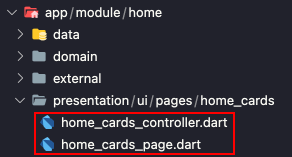
</details>

--- 

```bash
# Generate Controller
flutter_clean_cli g controller lib/app/module/home HomeCards
# Or
flutter_clean_cli g c lib/app/module/home HomeCards
```
<details>
<summary>Result</summary>

```dart
// presentation/ui/pages/home_cards/home_cards_controller.dart
class HomeCardsController {
  bool loading = false;

  void setLoading(bool value) {
    loading = value;
  }
}
```

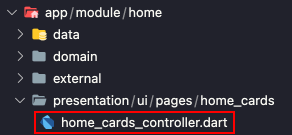
</details>

--- 

```bash
# Generate DataSource
flutter_clean_cli g datasource lib/app/module/home GetHomeCards
# Or
flutter_clean_cli g d lib/app/module/home GetHomeCards
```
<details>
<summary>Result</summary>

```dart
// data/datasources/get_home_cards_datasource.dart
abstract class GetHomeCardsDatasource {
  Future<void> call();
}
```
```dart
// external/datasources/get_home_cards_imp_datasource.dart
import '../../data/datasources/get_home_cards_datasource.dart';

class GetHomeCardsImpDatasource implements GetHomeCardsDatasource {
  @override
  Future<void> call() {
    // TODO: implement call
    throw UnimplementedError();
  }
}
```

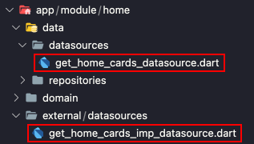
</details>

--- 

```bash 
# Generate Repository
flutter_clean_cli g repository lib/app/module/home GetHomeCards
# Or
flutter_clean_cli g repository lib/app/module/home GetHomeCards
```
<details>
<summary>Result</summary>

```dart
// domain/repositories/get_home_cards_repository.dart
abstract class GetHomeCardsRepository {
  Future<void> call();
}
```
```dart
// data/repositories/get_home_cards_imp_repository.dart
import '../../repositories/get_home_cards_repository.dart';

class GetHomeCardsImpRepository implements GetHomeCardsRepository {
  @override
  Future<void> call() {
    // TODO: implement call
    throw UnimplementedError();
  }
}
```
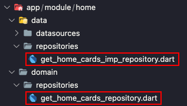
</details>

--- 

```bash
# Generate UseCase
flutter_clean_cli g usecase lib/app/module/home GetHomeCards
# Or
flutter_clean_cli g u lib/app/module/home GetHomeCards
```
<details>
<summary>Result</summary>

```dart
// domain/usecases/get_home_cards_usecase.dart
abstract class GetHomeCardsUsecase {
  Future<void> call();
}
```
```dart
// domain/usecases/get_home_cards_imp_usecase.dart
import 'get_home_cards_usecase.dart';

class GetHomeCardsImpUsecase implements GetHomeCardsUsecase {
  @override
  Future<void> call() {
    // TODO: implement call
    throw UnimplementedError();
  }
}
  
```
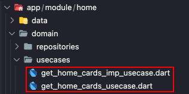
</details>

--- 

```bash
# Generate UseCase, Repository and DataSource
flutter_clean_cli g usecase lib/app/module/home GetHomeCards -r -d
# Or
flutter_clean_cli g u lib/app/module/home GetHomeCards -r -d
```
<details>
<summary>Result</summary>

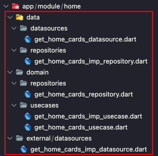
</details>


--- 

```bash
# Generate Service
flutter_clean_cli g service lib/app/module/home HomeCards
# Or
flutter_clean_cli g s lib/app/module/home HomeCards
```
<details>
<summary>Result</summary>

```dart
// domain/services/home_cards_service.dart
abstract class HomeCardsService {
  Future<void> call();
}
```
```dart
// domain/services/home_cards_imp_service.dart
import 'home_cards_service.dart';

class HomeCardsImpService implements HomeCardsService {
  @override
  Future<void> call() {
    // TODO: implement call
    throw UnimplementedError();
  }
}
  
```

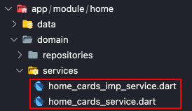
</details>

--- 

```bash
# Generate Entity
flutter_clean_cli g entity lib/app/module/home Home
# Or
flutter_clean_cli g e lib/app/module/home Home
```
<details>
<summary>Result</summary>

```dart
// domain/models/entities/home_entity.dart 
class HomeEntity {
  HomeEntity();
}
```
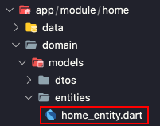
</details>

--- 

```bash
# Generate Dto
flutter_clean_cli g dto lib/app/module/home Home
```
<details>
<summary>Result</summary>

```dart
// domain/models/dtos/home_dto.dart
import '../../models/entities/home_entity.dart';

class HomeDto extends HomeEntity {
  HomeDto() : super();
}
```
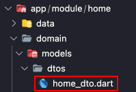
</details>

---

```file
-------------------------- HELPS --------------------------

i, init Generate the project's configurable files...
Example: flutter_clean_cli init

mf, microfrontend Select the option to create new microfrontend components...
Example: flutter_clean_cli mf

l, layer Generates the folder structure of a module...
Example: flutter_clean_cli g l lib/app/modules/module_name

p, page Create a new page with a controller...
Example: flutter_clean_cli g p lib/app/modules/module_name Name

c, controller Create a new controller...
Example: flutter_clean_cli g c lib/app/modules/module_name Name

d, datasource Create the fetching layer data from external sources...
Example: flutter_clean_cli g d lib/app/modules/module_name Name

r, repository Create the layer to handle the data...
Example: flutter_clean_cli g r lib/app/modules/module_name Name

u, usecase Create the layer to handle the business rules...
Example: flutter_clean_cli g u lib/app/modules/module_name Name

s, service Create the layer to handle services...
Example: flutter_clean_cli g s lib/app/modules/module_name Name

e, entity Create the entities...
Example: flutter_clean_cli g e lib/app/modules/module_name Name

dto Create the dto for data transfer...
Example: flutter_clean_cli g dto lib/app/modules/module_name Name

```
### Reserved Words

The reserved words can be used in the templet files that are generated in .flutter_clean_cli/templete the reserved words must be used inside mustaches `{{}}` example `{{name}}`, can also be used in reserved words an extension, example `{{name.pascalCase}}` whose extension will format the word as needed, you can check the lists below for all reserved words and extensions.

* `Reserved words can be edited in my_project\.flutter_clean_cli\configs.json`

| Reserved Words               | Default                |
|------------------------------|-----------------------------------------------------------------------------------------------------------|
| name                         | Entrada pelo terminal, este valor é o último parâmetro da expressão para gerar os modelos                 |
| path                         | Entrada pelo terminal, caminho onde o novo arquivo será gerado                                            |
| module                       | input input by the terminal, name of the module that will generate the new files                          |
| projectName                  | Entrada do nome do projeto quando é criado um componente de microfrontend                                 |
| projectNameComplete          | O nome do projeto concatenado com o padrão do modelo dos microfrontend                                    |
| repositoryPathInterface      | domain/repositories                                                                                       |
| repositoryNameFileInterface  | {{name.snakeCase}}_repository                                                                             |
| repositoryPath               | data/repositories                                                                                         |
| repositoryNameFile           | {{name.snakeCase}}_imp_repository                                                                         |
| repositoryNameClassInterface | {{name.pascalCase}}Repository                                                                             |
| repositoryNameClass          | {{name.pascalCase}}ImpRepository                                                                          |
| datasourcePathInterface      | data/datasources                                                                                          |
| datasourceNameFileInterface  | {{name.snakeCase}}_datasource                                                                             |
| datasourcePath               | external/datasources                                                                                      |
| datasourceNameFile           | {{name.snakeCase}}_imp_datasource                                                                         |
| datasourceNameClassInterface | {{name.pascalCase}}Datasource                                                                             |
| datasourceNameClass          | {{name.pascalCase}}ImpDatasource                                                                          |
| usecasePathInterface         | domain/usecases                                                                                           |
| usecaseNameFileInterface     | {{name.snakeCase}}_usecase                                                                                |
| usecasePath                  | domain/usecases                                                                                           |
| usecaseNameFile              | {{name.snakeCase}}_imp_usecase                                                                            |
| usecaseNameClassInterface    | {{name.pascalCase}}Usecase                                                                                |
| usecaseNameClass             | {{name.pascalCase}}ImpUsecase                                                                             |
| pagePath                     | presentation/ui/pages/{{name.snakeCase}}                                                                  |
| pageNameFile                 | {{name.snakeCase}}_page                                                                                   |
| pageNameClass                | {{name.pascalCase}}Page                                                                                   |
| controllerPath               | presentation/ui/pages/{{name.snakeCase}}                                                                  |
| controllerNameFile           | {{name.snakeCase}}_controller                                                                             |
| controllerNameClass          | {{name.pascalCase}}Controller                                                                             |

### Methods

The Methods can be used in `triggers` or `templates`, and work in sequence, example `{{path.replace(str1,str2).replace(str3, str4)}}`.

*WARNING:* If changing routes, use in Windows `\\` and in Mac or Linux `/`.

| Method    | Exemple    |
|--------------|------------|
| replace    | {{path.replace(string1,string2)}}  |

### Extensions

| Extension    | Exemple    |
|--------------|------------|
| camelCase    | testeCase  |
| constantCase | TESTE_CASE |
| sentenceCase | Teste case |
| snakeCase    | teste_case |
| dotCase      | teste.case |
| paramCase    | teste-case |
| pathCase     | teste/case |
| pascalCase   | TesteCase  |
| headerCase   | Teste-Case |
| titleCase    | Teste Case |

### Triggers

In `.flutter_clean_cli/templete` a `{{term}}_replace_trigger.json` file is generated where from your annotation it can apply a replace to any input expression, for example:

```json
[
    {
        "pathFile": "{{path}}\\{{module}}_module.dart",
        "from": "//imports",
        "to": "//imports\nimport '{{controllerPath}}/{{controllerNameFile}}.dart';"
    },
    {
        "pathFile": "{{path}}\\{{module}}_module.dart",
        "from": "//Dependence",
        "to": "//Dependence\nfinal {{controllerNameClass.camelCase}} = {{controllerNameClass.pascalCase}};"
    }
]
```
Where will perform a replace on the pointed file, from the expression.

##### Generate new file

In `.flutter_clean_cli / templete` a file `{{term}} _ new_file_trigger.json` is generated where, from his annotation, he can create a new file with the pre-defined templete, for example:

Note, the ``generate`` variable must be ``true`` to generate the file.

```json
[
    {
        "pathFile": "{{path}}\\{{module}}_module",
        "pathTemplete": ".flutter_clean_cli/template/layer/complete_new_file_exemple.template",
        "generate": true
    }
]
```

### Templates

 ``.flutter_clean_cli/template/layer/complete_new_file_exemple.template``

```file
class {{module.pascalCase}}Module extends Module {
  @override
  final List<Bind> binds = [
    //Usecases

    //Repositories

    //Datasources
      
    //Controllers
  ];

  @override
  final List<ModularRoute> routes = [
    //Pages
  ];
}

```
Where will generate a new file from the defined template.

### Tests

To add tests, just create a template, example:

```file
import 'package:flutter_test/flutter_test.dart';

import 'package:{{path.replace(\,/).replace(lib/,)}}/{{name.snakeCase}}';

void main() {
  test('adds one to input values', () {
    final calculator = Calculator();
    expect(calculator.addOne(2), 3);
    expect(calculator.addOne(-7), -6);
    expect(calculator.addOne(0), 1);
  });
}
```

Then add the path of the _template_ in the _trigger_ of creation of the class to be tested, making a _replace_ of the _path_ of this class, forwarding the test file to the tests folder, example:

```json
[
    {
        "pathFile": "{{path.replace(lib/app,test)}}/{{name.snakeCase}}_test",
        "pathTemplete": ".flutter_clean_cli/template/example_test.template",
        "extension": "dart",
        "replaceOldFileWithNew": false,
        "generate": true
    }
]
```

---
###### Submit feature and bug requests to improve __CLI__ [report issues](https://github.com/jheimes-silveira/flutter_clean_cli/issues).
